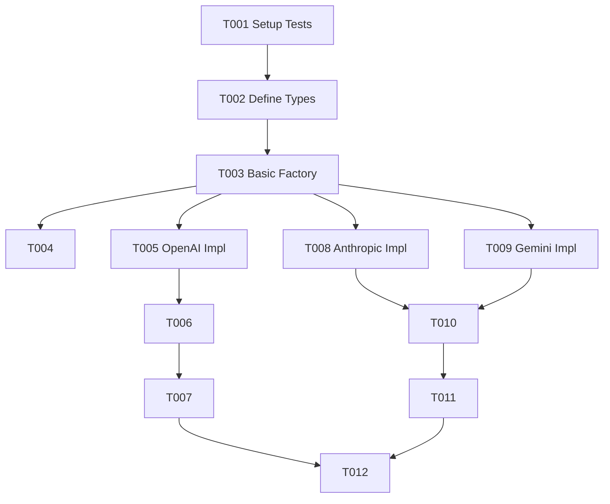

# Tasks: LLM Configuration Alignment

**Feature Branch**: `004-llm-config-baseurl`
**Status**: In Progress

## Phase 1: Setup
> **Goal**: Prepare test environment for configuration changes.

- [x] T001 Create test file packages/llm/__tests__/config.test.ts

## Phase 2: Foundational
> **Goal**: Define the new configuration types and the factory function structure.
> **Blocking**: Must be completed before implementing specific provider logic.

- [x] T002 Define discriminated union TextAdapterConfig in packages/llm/src/types.ts
- [x] T003 Implement basic createTextAdapter factory in packages/llm/src/adapters.ts
- [x] T004 Export createTextAdapter from packages/llm/src/index.ts

## Phase 3: User Story 1 - Configure Custom Base URL (OpenAI)
> **Goal**: Enable custom baseURL and organization for OpenAI-compatible providers.
> **Priority**: P1

**Independent Test**: Verify `createTextAdapter` with OpenAI config and custom baseURL returns a working adapter (mocked).

- [x] T005 [US1] Implement OpenAI support in createTextAdapter with baseURL/org in packages/llm/src/adapters.ts
- [x] T006 [US1] Update createOpenAIAdapter helper to support new options in packages/llm/src/adapters.ts
- [x] T007 [US1] Add tests for OpenAI baseURL in packages/llm/__tests__/config.test.ts

## Phase 4: User Story 2 - Explicit API Key Configuration
> **Goal**: Enable explicit API key configuration for all providers.
> **Priority**: P2

**Independent Test**: Verify `createTextAdapter` with explicit apiKey works for all providers.

- [x] T008 [P] [US2] Implement Anthropic support in createTextAdapter with apiKey in packages/llm/src/adapters.ts
- [x] T009 [P] [US2] Implement Gemini support in createTextAdapter with apiKey in packages/llm/src/adapters.ts
- [x] T010 [P] [US2] Update createAnthropicAdapter and createGeminiAdapter helpers in packages/llm/src/adapters.ts
- [x] T011 [US2] Add tests for API key configuration in packages/llm/__tests__/config.test.ts

## Phase 5: Polish & Cross-Cutting
> **Goal**: Ensure type safety and backward compatibility.

- [x] T012 Verify exports and backward compatibility in packages/llm/src/index.ts

## Dependencies

## Parallel Execution Examples

**User Story 2 (API Key)**:
- Developer A can work on Anthropic support (T008).
- Developer B can work on Gemini support (T009).
- Both depend only on T003 (Basic Factory).

## Implementation Strategy

1.  **MVP (US1)**: We will first define the types and implement the `createTextAdapter` factory with OpenAI support. This delivers the highest priority value (custom baseURL).
2.  **Expansion (US2)**: Once the factory pattern is established, we will add support for Anthropic and Gemini, enabling explicit API keys.
3.  **Verification**: Each step will be verified with unit tests in `config.test.ts`.
